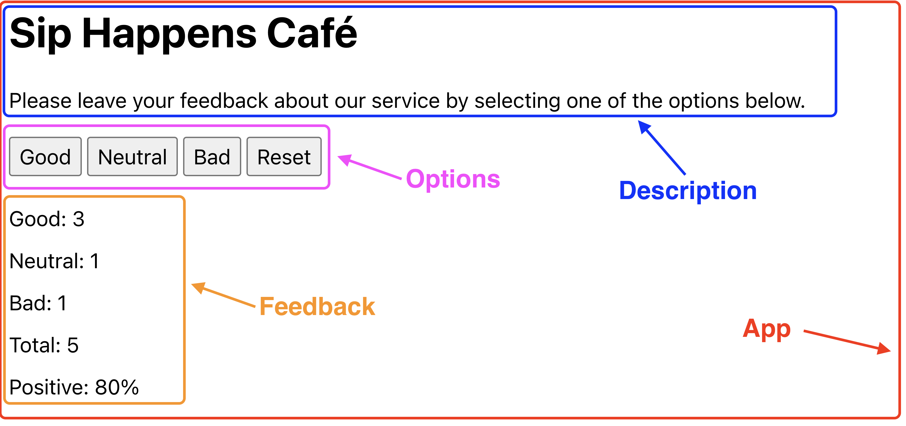

# Tier 4. Module 1: Mastering Front-End Development with React

## Topic 3 - Events. State
## Topic 4 - Life cycle

## Homework

### Technical task - Feedback widget

Write an application to collect reviews about **Sip Happens Café**.
The application should display the number of collected reviews for each category: **good**, **neutral**, **bad**. The application should store feedback statistics between page refreshes.

#### Components

In this task, the interface is already divided into components, your task is to transfer it to the code. Parts of the interface included in the component are surrounded by a frame of the corresponding color.

All components are rendered inside the `App` component.

#### Step 1

In the `App` component, create a state to store feedback types. Let it be an object with the same properties.

Declare the `Feedback` and `Options` components and use them in the `App` to display options and feedback. To do this, pass the necessary values ​​to them through props.

After this step, the application interface will look like this. Please note that the components are missing some elements, you will add them in the next steps.

#### Step 2

Add a state handler so that when buttons are clicked in the `Options` component, the state of the `App` component changes.

Declare the `updateFeedback(feedbackType)` function, which accepts one parameter - the type of feedback, that is, the name of the property from the state, the strings `“good”`, `“bad”` or `“neutral”`.

Pass the `updateFeedback` function as a prop to the `Options` component and call it when the buttons are clicked, passing the type of feedback (`“good”`, `“bad”` or `“neutral”` lines) as an argument.

After this step, when you click on the buttons in the `Options` component, the interface will be updated.

#### Step 3

Make the `Feedback` component render only after at least one feedback has been collected. The total number of reviews is simply the sum of the states.

Since the state is stored in the `App` component, the calculation of `totalFeedback` will be correctly performed in this component, and the already calculated value will be transferred by props to other components, as well as used in the `App` for conditional rendering.

Transfer the message about the lack of statistics to the `Notification` component and display it in the `App`. For this, use conditional rendering in the `App` component.

#### Step 4

Add a `Reset` button to reset collected feedback to the `Options` component. When you click on it, the status responsible for reviews should reset. The `Reset` button is visible only if there is at least one feedback, just like the `Feedback` component.

For conditional rendering, use the pre-calculated `totalFeedback` value from the `App` component and pass it as a prop in `Options`.

#### Step 5

Expand the functionality of the application in such a way that the interface displays more statistics about the collected feedback. Add a display of the total number of collected reviews from all categories and the percentage of positive reviews. These are all computed values ​​that do not need to be stored in state. Pass these values ​​through props to the corresponding components.

Note that there is no need to create separate properties in the state for the `totalFeedback` and `positiveFeedback` values, as they are data that is easily calculated based on the existing state. This not only optimizes memory and resource usage, but also reduces the risk of out-of-sync errors.

#### Step 6

Make feedback statistics persist between page reloads. Use effects and local storage to save the state when it changes, and on page load initialize the state and local storage to read the saved data and write it to the state. If nothing is stored in local storage when the application is loaded, the state should be initialized to zeros.

### Acceptance criteria

* Main link: the assignment work page on [Vercel](https://goit-neo-react-hw-module2-brown.vercel.app/).
* The project was created using [Vite](https://vitejs.dev/).
* When visiting the live task page, there are no errors or warnings in the console.
* For each component, there is a separate folder in the `src/components` folder that contains the JSX file of the React component itself and its styles file. The name of the folder, the component file (with the extension `.jsx`) and the style file (before `.module.css`) are the same and correspond to the names specified in the tasks (if there were any)
* All task components are rendered on the same page, inside the root `<App>` component.
* Anything the component expects as props is passed to it when called.
* The JS code is clean and clear, using **Prettier**.
* Styling is done by **CSS modules**.
